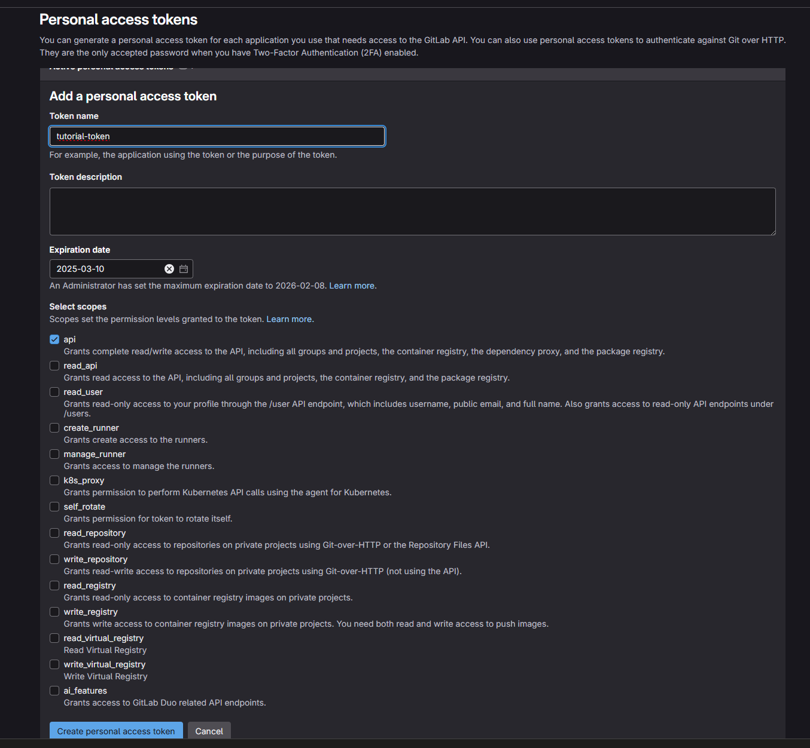

# Tutorial: Setup terraform project with AGE encrypted state on gitlab.com

[](../../README.md)[](./index.md)

## About

This tutorial will guide you through the steps to setup the Terraform SOPS backend to save your [AGE](https://github.com/FiloSottile/age) encrypted state in the terraform state backend provided by <https://gitlab.com>.

After finishing this tutorial you'll have started Terraform SOPS backend on your machine configured to
* use <https://gitlab.com> as terraform state backend.
* use AGE to encrypt and decrypt all terraform states send to the backend.

This tutorial will not cover the creation of a [AGE](https://github.com/FiloSottile/age) key pair.  
The the [AGE](https://github.com/FiloSottile/age) documentation if you want to learn how to handle that topic.

## Actions

### Collect required data from gitlab.com

1. Go to <https://gitlab.com/-/user_settings/personal_access_tokens>
2. Create an API scoped access token 
3. Save the value of the token for later use.
    * The token value is from now on referenced as `%gitlab-api-token%`
4. Open the gitlab.com project you want to use for your terraform state.
5. Get the project ID from `Settings` > `General`.
    * The ID is from now on referenced as `%project-id%`.

### Setup your environment

```sh
export TF_HTTP_USERNAME=oauth
export TF_HTTP_PASSWORD=%gitlab-api-token%
CONTAINER_COMMAND=podman # change to docker if you prefer to use docker
PROJECT_ID=%project-id%
```

### Perform the tutorial

1. Prepare your terraform-sops-backend configuration as `terraform-sops-backend.env`
    ```sh
    # GitLab uses POST instead of LOCK to acquire a state lock
    BACKEND_LOCK_METHOD=POST
    # GitLab uses DELETE instead of UNLOCK to release a state lock
    BACKEND_UNLOCK_METHOD=DELETE
    BACKEND_URL=https://gitlab.com
    TRANSFORM_AGE_PUBLIC_KEY=age17gnuhjensr0f902238xt4jkdu9qh9anhjklfn7tr8m3ex5ltxfxqt3yx08
    TRANSFORM_AGE_PRIVATE_KEY=AGE-SECRET-KEY-1Z22A6EL3ECQC96ZDMPD5KRPUX32SCAMU2DJGV3Q48PXN3ZW535VQFQDEF9
    ```
2. Start the container in background
    ```sh
    ${CONTAINER_COMMAND} run --rm -d --name terraform-sops-backend --env-file terraform-sops-backend.env  -p 8080:8080 ghcr.io/isleofbeans/terraform-sops-backend:latest
    ```
5. Create a directory for your terraform module
    ```sh
    mkdir age-encrypted-terraform-state
    cd age-encrypted-terraform-state
    ```
6. Create a `main.tf` with all the terraform content.
    ```terraform
    resource "random_password" "this" {
      length = 21
    }

    output "password" {
      sensitive = true
      value = random_password.this.result
    }

    terraform {
      # REPLACE %project-id% with your actual project ID from GitLab
      # in vi use :%s/.project-id./%project-id%/g
      backend "http" {
        address        = "http://localhost:8080/api/v4/projects/%project-id%/terraform/state/sops-age"
        lock_address   = "http://localhost:8080/api/v4/projects/%project-id%/terraform/state/sops-age/lock"
        unlock_address = "http://localhost:8080/api/v4/projects/%project-id%/terraform/state/sops-age/lock"
        retry_wait_min = 5
      }
    }

    terraform {
      required_version = "~> 1.10"
      required_providers {
        random = {
          source = "hashicorp/random"
          version = "~> 3.6"
        }
      }
    }
    ```
7. Initialize terraform
    ```sh
    terraform init
    ```
8. Run terraform apply
    ```sh
    terraform apply -auto-approve
    ```
9.  Curl the state from gitlab.com to see it is actually encrypted
    ```sh
    curl -u "${TF_HTTP_USERNAME}:${TF_HTTP_PASSWORD}" "https://gitlab.com/api/v4/projects/${PROJECT_ID}/terraform/state/sops-age"
    ```
10. Curl the state from localhost:8080 to see terraform-sops-backend is decrypting the state
    ```sh
    curl -u "${TF_HTTP_USERNAME}:${TF_HTTP_PASSWORD}" "http://localhost:8080/api/v4/projects/${PROJECT_ID}/terraform/state/sops-age"
    ```
11. Show output from terraform
    ```sh
    terraform output -raw password
    ```

### Cleanup

To clean up your workplace stop the running container providing the terraform-sops-backend service.

```sh
${CONTAINER_COMMAND} stop terraform-sops-backend
```
